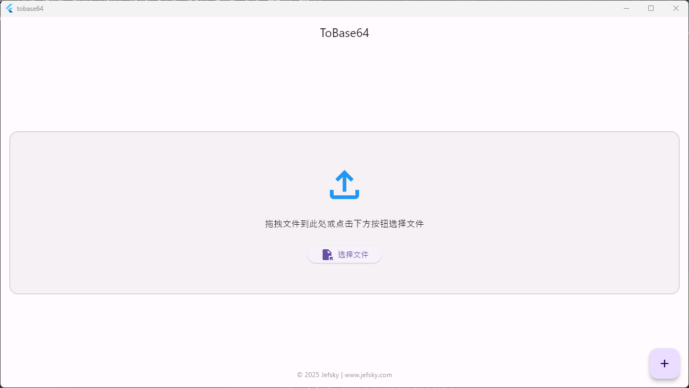

# ToBase64

这是一个简单的Flutter应用程序，用于将文件转换为Base64编码。

## 功能

- 选择任意文件并将其转换为Base64编码
- 复制Base64编码到剪贴板
- 将Base64编码保存为文本文件
- 设置默认保存路径，避免每次都需要选择
- 批量下载选中的文件到默认路径
- 文件勾选功能，支持全选/取消全选
- 打开保存文件夹，方便查看已保存的文件

## 如何使用

1. 拖放文件到应用程序窗口或点击"选择文件"按钮添加文件
2. 应用程序会自动将文件转换为Base64编码
3. 转换完成后，您可以：
   - 点击"复制"按钮复制Base64编码到剪贴板
   - 点击"保存"按钮选择保存位置并保存Base64编码
   - 点击"设置默认保存路径"按钮设置默认保存位置
   - 勾选要批量下载的文件，然后点击"批量下载"按钮将选中的文件保存到默认路径
   - 点击"打开保存路径文件夹"按钮直接打开保存文件的文件夹

## 屏幕截图



## 安装

### 下载预构建版本

访问[Releases页面](https://github.com/Jefsky/ToBase64/releases)下载最新版本。

### 从源代码构建

确保您的环境中已安装Flutter，然后运行：

```bash
flutter pub get
flutter run
```

## 依赖项

- file_picker: 用于选择文件
- path_provider: 用于获取应用程序文档目录
- desktop_drop: 用于支持文件拖放功能
- shared_preferences: 用于保存默认路径设置
- url_launcher: 用于打开文件夹

## 版本历史

### v1.3.0 (2025-04-30)
- 添加批量下载功能
- 添加默认保存路径设置
- 添加文件勾选功能
- 添加打开保存路径文件夹功能

### v1.2.0
- 添加文件拖放支持
- 改进用户界面

### v1.1.0
- 添加复制到剪贴板功能
- 添加保存Base64编码到文件功能

### v1.0.0
- 初始版本

## 许可证

MIT

## 作者

Jefsky | www.jefsky.com
